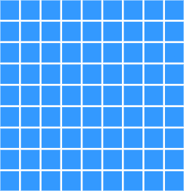
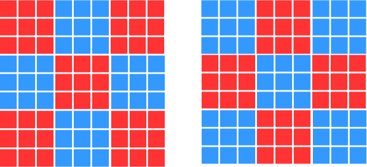
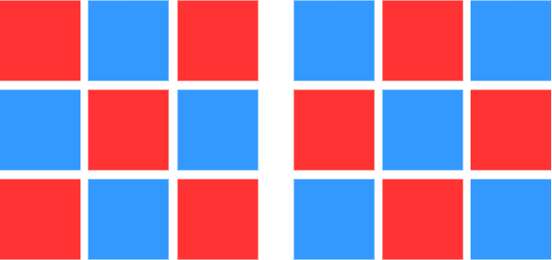

# Grid Homework

This is from AI lecture homework

## Statement

You have 9×9 grid of squares, each of which can be colored red or blue. The grid is initially colored all blue, but you can change the color of any square any number of times. Imagining the grid divided into nine 3×3 sub-squares, you want each sub-square to be all one color but neighboring sub-squares to be different colors.

## Step

Draw 9x9 blue grid of squares

Divide 9x9 grid into 9 3x3 sub-squares

Based on statement above, we can make goal state to one of 9x9 grids below

Simplify 9x9 grid into 3x3

## Question

C. Formulate this problem in the straightforward way. Compute the size of the state space.

    State space of 9x9 grid is 81

B. Given the goal, we need consider only colorings where each sub-square is uniformly colored. Reformulate the problem and compute the size of the state space.

    Simplifying after formulate will give 3x3 grid with 9 state space

C. How many solutions does this problem have?

    There are 2 solution in this problem as shown below, (shown by 3x3 grid)

